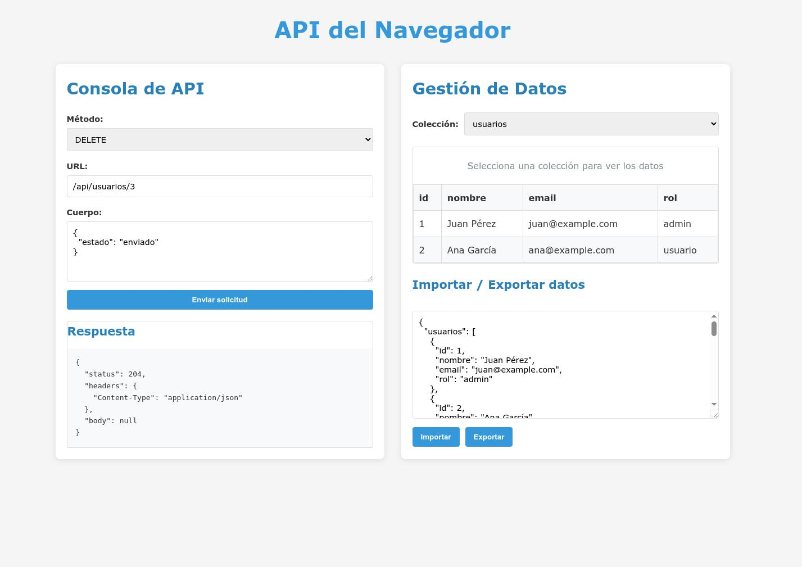

# RESTless

<div align="center">
  
  
  
</div>

<p align="center">
  <b>Complete REST API that works 100% in the browser</b><br>
  A replacement for json-server without Node.js dependencies or external servers
</p>

## About RESTless

RESTless is a simulated REST API with data persistence that works entirely in the browser. It provides all the functionality of json-server without requiring Node.js or any backend services.

Perfect for front-end development, prototyping, testing, and educational purposes.

## 🌟 Features

- 🔥 **Complete REST API** - Full support for GET, POST, PUT, PATCH, DELETE
- 💾 **Built-in Persistence** - Automatic data storage using localStorage/IndexedDB
- 📋 **Visual Interface** - UI dashboard to explore and manipulate your data
- 📤 **Import/Export** - Easy JSON data import and export
- 📱 **Responsive Design** - Works on desktop and mobile browsers
- 🧪 **Perfect for Testing** - Ideal for prototypes and frontend development
- 🔒 **No Backend Required** - Everything runs client-side
- 🚀 **Zero Dependencies** - No npm installs needed for the runtime

## 📸 Screenshot



## 🚀 Getting Started

### Installation

```bash
# Clone the repository
git clone https://github.com/devalexanderdaza/RESTless.git

# Navigate to the project directory
cd RESTless

# Install dependencies
npm install

# Start the development server
npm run dev
```

### Usage

Once the development server is running, navigate to `http://localhost:5173` (or the URL shown in your terminal) to access the RESTless interface.

#### 1. Direct Browser Import

```html
<script type="module">
  import { RESTless } from 'https://cdn.jsdelivr.net/gh/devalexanderdaza/RESTless@latest/dist/restless.es.js';
  
  const api = new RESTless();
  api.initialize({
    users: [
      { id: 1, name: "John Doe", email: "john@example.com" },
      { id: 2, name: "Jane Smith", email: "jane@example.com" }
    ]
  });
  
  // Now you can use the API
  const users = await api.get('/users');
  console.log(users);
</script>
```

#### 2. NPM Package (Coming Soon)

```bash
npm install restless-api
```

```javascript
import { RESTless } from 'restless-api';

const api = new RESTless();
// Configuration and usage
```

## 📖 API Reference

RESTless follows standard REST conventions:

### Base Routes

- `GET /api` - List all available collections
- `GET /api/collection` - Get all items in a collection
- `GET /api/collection?param=value` - Filter items by property
- `GET /api/collection/:id` - Get a specific item by ID
- `POST /api/collection` - Create a new item
- `PUT /api/collection/:id` - Update an item (full replacement)
- `PATCH /api/collection/:id` - Partially update an item
- `DELETE /api/collection/:id` - Delete an item

### JavaScript API

```javascript
// Initialize with data
api.initialize({
  users: [
    { id: 1, name: "John", role: "admin" },
    { id: 2, name: "Jane", role: "user" }
  ]
});

// Make requests
const users = await api.get('/users');
const filtered = await api.get('/users?role=admin');
const user = await api.get('/users/1');
const newUser = await api.post('/users', { name: "Alice", role: "editor" });
const updated = await api.put('/users/1', { name: "John Doe", role: "admin" });
const patched = await api.patch('/users/2', { role: "editor" });
const deleted = await api.delete('/users/1');
```

## 📋 Examples

### Basic Usage Example

```javascript
// Initialize RESTless
const api = new RESTless();

// Set up initial data
api.initialize({
  products: [
    { id: 1, name: "Laptop", price: 999, inStock: true },
    { id: 2, name: "Phone", price: 699, inStock: false }
  ]
});

// Get all products
const products = await api.get('/products');

// Filter products
const inStockProducts = await api.get('/products?inStock=true');

// Add a new product
const newProduct = await api.post('/products', {
  name: "Tablet",
  price: 499,
  inStock: true
});

// Update a product
await api.put('/products/1', {
  name: "Gaming Laptop",
  price: 1299,
  inStock: true
});

// Delete a product
await api.delete('/products/2');
```

## 🤝 Contributing

Contributions are welcome! Here's how you can help:

1. Fork the repository
2. Create your feature branch (`git checkout -b feature/amazing-feature`)
3. Commit your changes (`git commit -m 'Add some amazing feature'`)
4. Push to the branch (`git push origin feature/amazing-feature`)
5. Open a Pull Request

See the [contributing guide](CONTRIBUTING.md) for detailed instructions.

## 📄 License

This project is licensed under the MIT License - see the [LICENSE](LICENSE.md) file for details.

## 👨‍💻 Author

**Alexander Daza**
- Website: [alexanderdaza.com](https://www.alexanderdaza.dev)
- GitHub: [@devalexanderdaza](https://github.com/devalexanderdaza)
- LinkedIn: [in/devalexanderdaza](https://linkedin.com/in/devalexanderdaza)

## 🌟 Star History

[](https://star-history.com/#devalexanderdaza/RESTless&Date)

## 🔗 Related Projects

- [json-server-vercel](https://github.com/kitloong/json-server-vercel) - RESTless server inspired on json-server and vercel
- [json-server](https://github.com/typicode/json-server) - RESTless was inspired by json-server
- [miragejs](https://miragejs.com/) - Another client-side API mocking library

---

<p align="center">
  Made with ❤️ by <a href="https://github.com/devalexanderdaza">Alexander Daza</a>
</p>
