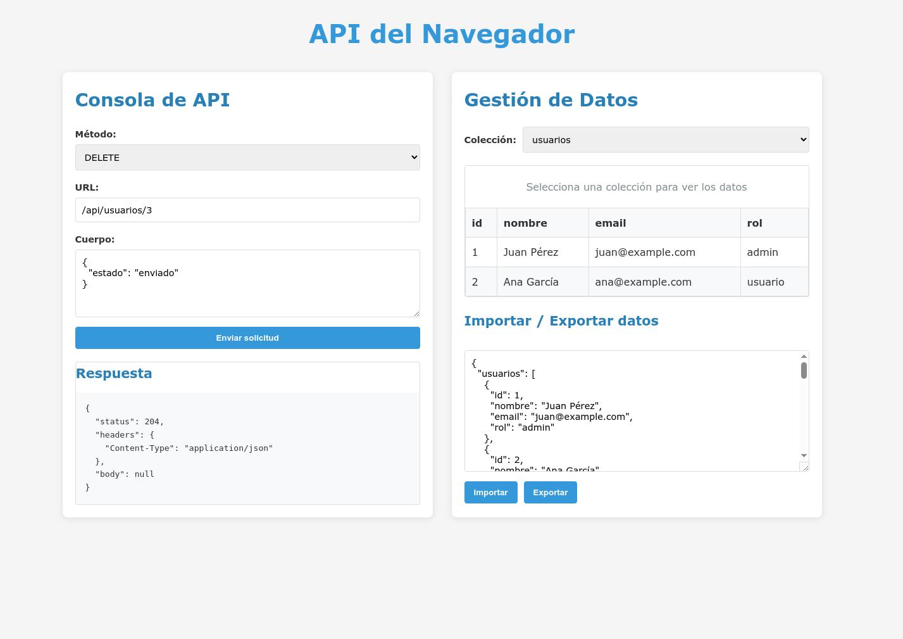

# RESTless

<div align="center">
  
  
  
  
</div>

<p align="center">
  <b>Complete REST API that works 100% in the browser</b><br>
  A replacement for json-server without Node.js dependencies or external servers
</p>

## About RESTless

RESTless is a simulated REST API with data persistence that works entirely in the browser. It provides all the functionality of json-server without requiring Node.js or any backend services.

Perfect for front-end development, prototyping, testing, and educational purposes.

## 🌟 Features

- 🔥 **Complete REST API** - Full support for GET, POST, PUT, PATCH, DELETE
- 💾 **Pluggable Storage** - Switch between `localStorage` and `IndexedDB` at runtime
- 📋 **Visual Interface** - UI dashboard to explore and manipulate your data
- 📤 **Import/Export** - JSON and CSV data import and export
- 🧩 **Schema Validation** - Define schemas with types, ranges, enums, patterns and custom validators
- 🔗 **Referential Integrity** - Cascade deletes/updates and restrict actions across related collections
- 🔍 **Advanced Querying** - Pagination (offset & cursor), filtering, multi-field sorting, full-text search
- 🔎 **Schema Introspection** - Expose registered schemas via `/_schemas` endpoints
- 📱 **Responsive Design** - Works on desktop and mobile browsers
- 🧪 **Perfect for Testing** - Ideal for prototypes and frontend development
- 🔒 **No Backend Required** - Everything runs client-side
- 🚀 **Zero Runtime Dependencies** - No npm packages required at runtime

## 📸 Screenshot



## 🚀 Getting Started

### Requirements

- Node.js ≥ 18.0.0
- pnpm ≥ 9.0.0

### Installation

```bash
# Clone the repository
git clone https://github.com/devalexanderdaza/RESTless.git

# Navigate to the project directory
cd RESTless

# Install dependencies
pnpm install

# Start the development server
pnpm dev
```

Once the development server is running, navigate to `http://localhost:5173` (or the URL shown in your terminal) to access the RESTless interface.

### Available Scripts

| Script | Description |
|--------|-------------|
| `pnpm dev` | Start the development server |
| `pnpm build` | Compile TypeScript and build for production |
| `pnpm preview` | Preview the production build locally |
| `pnpm lint` | Run ESLint on the source files |
| `pnpm format` | Format source files with Prettier |
| `pnpm test` | Run the test suite once |
| `pnpm test:watch` | Run tests in watch mode |
| `pnpm test:coverage` | Run tests with coverage report |

## 📖 API Reference

RESTless follows standard REST conventions. All routes are prefixed with `/api` by default (configurable via `ServerConfig.baseUrl`).

### Standard CRUD Endpoints

| Method | Path | Description |
|--------|------|-------------|
| `GET` | `/api` | List all available collection names |
| `GET` | `/api/:collection` | Get all items (supports query params) |
| `GET` | `/api/:collection/:id` | Get a specific item by ID |
| `POST` | `/api/:collection` | Create a new item |
| `PUT` | `/api/:collection/:id` | Replace an item (full update) |
| `PATCH` | `/api/:collection/:id` | Partially update an item |
| `DELETE` | `/api/:collection/:id` | Delete an item |

### Schema Endpoints

| Method | Path | Description |
|--------|------|-------------|
| `GET` | `/api/_schemas` | List all registered schemas |
| `GET` | `/api/_schemas/:collection` | Get the schema for a specific collection |

### Advanced Query Parameters

Append these as URL query parameters to `GET /api/:collection`:

#### Filtering

Use `field=value` for equality, or `field__operator=value` for advanced comparisons:

| Operator suffix | Meaning | Example |
|-----------------|---------|---------|
| *(none)* | Equal | `?role=admin` |
| `__ne` | Not equal | `?status__ne=cancelled` |
| `__gt` | Greater than | `?price__gt=100` |
| `__gte` | Greater than or equal | `?price__gte=100` |
| `__lt` | Less than | `?stock__lt=10` |
| `__lte` | Less than or equal | `?stock__lte=10` |
| `__like` | Contains (case-insensitive) | `?name__like=phone` |
| `__in` | Value in list | `?status__in=pending,shipped` |
| `__nin` | Value not in list | `?status__nin=cancelled` |

#### Sorting

```
?_sort=price,name&_order=asc,desc
```

Multiple fields are separated by commas. `_order` defaults to `asc`.

#### Pagination (offset-based)

```
?_page=1&_limit=10
```

Response headers include pagination metadata:
- `X-Total-Count` — total number of matching items
- `X-Page` — current page
- `X-Total-Pages` — total number of pages
- `X-Has-More` — whether more pages exist

#### Pagination (cursor-based)

```
?_cursor=<cursor>&_limit=10
```

Response header `X-Next-Cursor` contains the cursor for the next page.

#### Full-text Search

```
?_q=searchterm
```

Searches across all string fields. To restrict the search to specific fields:

```
?_q=searchterm&_fields=name,description
```

#### Expanding Relations

For a single-item request, pass `_expand=true` to inline related objects:

```
GET /api/orders/1?_expand=true
GET /api/orders/1?_expand=true&_expandDepth=2
```

### Response Headers

| Header | Description |
|--------|-------------|
| `Content-Type` | Always `application/json` |
| `Location` | Set on `201 Created` responses, pointing to the new resource |
| `X-Total-Count` | Total matching items (paginated list responses) |
| `X-Page` | Current page number |
| `X-Total-Pages` | Total page count |
| `X-Has-More` | `true` if more pages are available |
| `X-Next-Cursor` | Cursor token for the next page (cursor pagination) |

## 🧩 Schema Management

Define a schema to enable validation, default values, transformations and referential integrity for a collection.

### Defining a Schema

```typescript
import { SchemaDefinition } from './core/schema';

const usersSchema: SchemaDefinition = {
  name: 'users',
  timestamps: true, // automatically add createdAt and updatedAt fields
  fields: {
    id: { type: 'number', required: true },
    name: {
      type: 'string',
      required: true,
      minLength: 3,
      maxLength: 50
    },
    email: {
      type: 'string',
      required: true,
      validate: (value) => {
        const ok = /^[^\s@]+@[^\s@]+\.[^\s@]+$/.test(value);
        return ok || 'Invalid email format';
      }
    },
    role: {
      type: 'string',
      enum: ['admin', 'user', 'editor'],
      defaultValue: 'user'
    },
    orders: {
      type: 'array',
      relation: {
        type: 'oneToMany',
        collection: 'orders',
        field: 'userId',
        onDelete: 'cascade' // delete related orders when a user is deleted
      }
    }
  }
};
```

### Registering a Schema

```typescript
import { Server } from './core/server';

const server = new Server();
server.registerSchema(usersSchema);
await server.initialize({ users: [] });
```

### Supported Field Types

`string` | `number` | `boolean` | `object` | `array` | `null` | `any`

A field can also accept multiple types: `type: ['string', 'null']`.

### Field Validation Options

| Option | Type | Description |
|--------|------|-------------|
| `required` | `boolean` | Field must be present and non-null |
| `defaultValue` | `any \| () => any` | Value used when the field is absent on create |
| `min` / `max` | `number` | Numeric range validation |
| `minLength` / `maxLength` | `number` | String length validation |
| `pattern` | `string` | Regex pattern (string fields) |
| `enum` | `any[]` | Allowed values |
| `validate` | `(v) => boolean \| string` | Custom validator — return `true` or an error message |
| `transform` | `(v) => any` | Transform value before storing (e.g. rounding) |
| `properties` | `Record<string, FieldDefinition>` | Nested object schema |
| `items` | `FieldDefinition` | Schema for array elements |

### Relation Types

| Type | Description |
|------|-------------|
| `oneToOne` | Single related item |
| `oneToMany` | Array of related items |
| `manyToOne` | Single parent item |
| `manyToMany` | Many items on both sides |

### Reference Actions (`onDelete` / `onUpdate`)

| Action | Description |
|--------|-------------|
| `cascade` | Automatically delete/update related records |
| `restrict` | Block the operation if related records exist |
| `setNull` | Set the foreign key to `null` |
| `setDefault` | Set the foreign key to its default value |

## 💾 Storage Backends

RESTless supports two persistence adapters, configurable at startup or switched at runtime.

### Configure at startup

```typescript
import { Server } from './core/server';

// localStorage (default)
const server = new Server({ storageType: 'localStorage', storageKey: 'my-app-db' });

// IndexedDB
const server = new Server({ storageType: 'indexedDB', storageKey: 'my-app-db' });
```

### Switch at runtime

```typescript
// Migrate all in-memory data to IndexedDB without data loss
await server.changeStorage('indexedDB');
```

## 📋 Examples

### Basic CRUD

```typescript
import { Server } from './core/server';
import { registerApiEndpoints } from './api/endpoints';

const server = new Server();
registerApiEndpoints(server);

await server.initialize({
  products: [
    { id: 1, name: 'Laptop', price: 999, inStock: true },
    { id: 2, name: 'Phone', price: 699, inStock: false }
  ]
});

// List all products
const res = await server.handleRequest('GET', '/api/products', {});
// res.body → [{ id: 1, ... }, { id: 2, ... }]

// Filter
const res2 = await server.handleRequest('GET', '/api/products?inStock=true', {});

// Create
const res3 = await server.handleRequest('POST', '/api/products', {}, {
  name: 'Tablet', price: 499, inStock: true
});
// res3.status → 201

// Update
await server.handleRequest('PUT', '/api/products/1', {}, {
  name: 'Gaming Laptop', price: 1299, inStock: true
});

// Delete
await server.handleRequest('DELETE', '/api/products/2', {});
```

### Schema Validation Example

```typescript
const productsSchema = {
  name: 'products',
  timestamps: true,
  fields: {
    id:    { type: 'number', required: true },
    name:  { type: 'string', required: true, minLength: 3, maxLength: 100 },
    price: {
      type: 'number',
      required: true,
      min: 0,
      transform: (v) => Math.round(v * 100) / 100 // round to 2 decimals
    },
    stock: { type: 'number', required: true, min: 0, defaultValue: 0 }
  }
};

server.registerSchema(productsSchema);

// POST with invalid data → 400 with validation errors
const res = await server.handleRequest('POST', '/api/products', {}, { name: 'A', price: -5 });
// res.status → 400
// res.body  → { error: 'Validation error', details: [...] }
```

### Advanced Query Example

```typescript
// Paginated, sorted, filtered list
const res = await server.handleRequest(
  'GET',
  '/api/products?price__gte=100&_sort=price&_order=asc&_page=1&_limit=5',
  {}
);
// res.headers['X-Total-Count'] → '42'
// res.headers['X-Total-Pages'] → '9'

// Full-text search
const res2 = await server.handleRequest('GET', '/api/products?_q=laptop', {});
```

### Introspect Schemas

```typescript
// List all registered schemas
const res = await server.handleRequest('GET', '/api/_schemas', {});

// Get schema for a specific collection
const res2 = await server.handleRequest('GET', '/api/_schemas/products', {});
```

## 🛠️ Developer Tooling

The project ships with a complete developer tooling setup:

- **ESLint** (`eslint.config.mjs`) — flat-config ESLint 9 with TypeScript and Prettier integration
- **Prettier** (`.prettierrc`) — consistent code formatting
- **EditorConfig** (`.editorconfig`) — editor-level formatting rules
- **Vitest** — fast unit tests (`pnpm test`)

## 🤝 Contributing

Contributions are welcome! Here's how you can help:

1. Fork the repository
2. Create your feature branch (`git checkout -b feature/amazing-feature`)
3. Commit your changes (`git commit -m 'feat: add amazing feature'`)
4. Push to the branch (`git push origin feature/amazing-feature`)
5. Open a Pull Request

See the [contributing guide](CONTRIBUTING.md) for detailed instructions.

## 📄 License

This project is licensed under the MIT License - see the [LICENSE](LICENSE.md) file for details.

## 👨‍💻 Author

**Alexander Daza**
- Website: [alexanderdaza.com](https://www.alexanderdaza.dev)
- GitHub: [@devalexanderdaza](https://github.com/devalexanderdaza)
- LinkedIn: [in/devalexanderdaza](https://linkedin.com/in/devalexanderdaza)

## 🌟 Star History

[](https://star-history.com/#devalexanderdaza/RESTless&Date)

## 🔗 Related Projects

- [json-server-vercel](https://github.com/kitloong/json-server-vercel) - RESTless server inspired on json-server and vercel
- [json-server](https://github.com/typicode/json-server) - RESTless was inspired by json-server
- [miragejs](https://miragejs.com/) - Another client-side API mocking library

---

<p align="center">
  Made with ❤️ by <a href="https://github.com/devalexanderdaza">Alexander Daza</a>
</p>
